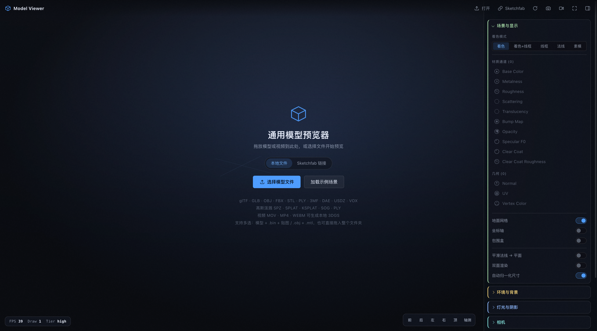

# Model Viewer · 通用模型预览器

一个纯前端的通用 3D 模型预览器，基于 three.js + Vite + TypeScript。拖入本地文件即可预览，无需后端，可直接部署为静态站点。



快速预览地址：https://glb-viewer2.vercel.app/

## 快速开始

```bash
npm install        # postinstall 会把 Draco / KTX2 解码器复制到 public/vendor
npm run dev        # http://localhost:5173
```

构建与本地验收：

```bash
npm run typecheck
npm run build      # 产物在 dist/，base 为相对路径，可直接静态托管
npm run preview
```

## 支持的格式

| 类别 | 扩展名 |
| --- | --- |
| 网格模型 | `.glb` `.gltf` `.obj` `.fbx` `.stl` `.ply` `.3mf` `.dae` `.usdz` `.vox` |
| 高斯泼溅 | `.spz` `.splat` `.ksplat` `.sog`，以及泼溅格式的 `.ply` |
| 环境贴图 | `.hdr` `.exr` |
| 调色 LUT | `.cube` `.3dl` |

glTF 的 Draco、KTX2/Basis、Meshopt 压缩均已启用，解码器随包分发，不依赖 CDN。

多文件格式（`.gltf` + `.bin` + 贴图，`.obj` + `.mtl`）支持一次多选或直接拖入整个文件夹；文件引用先按相对路径匹配，匹配不到时回退到同名文件，因此扁平化拖放也能正确装配。

高斯泼溅依赖的 [Spark](https://github.com/sparkjsdev/spark) 体积较大（约 5.5 MB），采用动态导入，只有在真正载入泼溅资产时才会下载。

## HDR 环境

侧栏「环境与背景」分两组：**程序化**（代码生成，零加载）与 **HDR 全景**（真实全景图）。

内置的 5 张全景由 `scripts/build-hdri.mjs` 从原预览器工程转换而来。原图最大到 3561×1779 / 18 MB，远超光照探针所需——PMREM 无论如何都会把它降到 256 px，而背景默认还带模糊。脚本会：

1. 解码 RLE RGBE，在**线性空间**做面积均值降采样到 1024×512（保持原始宽高比）；
2. 重新编码为 RLE RGBE；
3. 顺带生成 128 px 的 ACES 色调映射 PNG 缩略图供侧栏使用。

结果是 18.1 MB → 1.56 MB，5 张合计约 4.6 MB。它们放在 `public/hdri/`，**按需加载**：只有点到某张全景时才下载，解码后的贴图会缓存，来回切换不会重复请求。首屏因此完全不受影响。

重新生成（需要能访问源工程）：

```bash
npm run hdri
```

> 文件名已做通用化处理，但**图像内容本身仍受原始授权约束**（其中包含 Greyscalegorilla 等商业素材）。若要公开发布本项目，请先确认这些全景图的授权范围，或替换为 [Poly Haven](https://polyhaven.com/hdris) 等 CC0 素材。

## 功能

- **渲染** — ACES Filmic 色调映射、程序化 IBL 环境（8 组）+ 内置 HDR 全景（5 张）+ 自定义 HDR/EXR、环境旋转与强度、渐变/纯色/环境/透明背景、雾效
- **灯光** — 主光 / 补光 / 轮廓光三点布光，PCF 柔和阴影，地面接影板，无限网格
- **后期** — GTAO 环境光遮蔽、Bloom、3D LUT、Lift/Gamma/Gain 调色、饱和度与对比度、暗角、SMAA / FXAA
- **相机** — 轨道控制、自动框选（按包围球计算，模型旋转时不会出框）、六向 + 轴测视图预设、透视/正交切换、自动旋转
- **动画** — 载入后自动播放首个动画，支持切换片段、播放/暂停、时间轴拖拽、倍速
- **检视** — 着色 / 着色+线框 / 线框 / 法线 / 素模，材质通道隔离（Base Color、Metalness、Roughness、Scattering、Translucency、Bump、Opacity、Specular F0、Clear Coat、Clear Coat Roughness），几何通道（Normal / UV / Vertex Color），场景树、包围盒、坐标轴、三角面与贴图统计
- **输出** — 多倍率 PNG 截图，MP4 / WebM 录屏

侧栏展开时相机会把模型对齐到实际可见区域的中心，而不是被面板遮挡的画布中心。

## 快捷键

| 键 | 作用 |
| --- | --- |
| `Tab` | 显示/隐藏侧栏 |
| `F` | 重新框选模型 |
| `R` | 重置视角 |
| `Space` | 播放/暂停动画 |

## 冒烟测试

用 Playwright 在无头 Chromium（SwiftShader 软件渲染）里跑一遍完整流程，含真实文件载入与截图落盘：

```bash
npm run dev                      # 另开一个终端
npm run smoke                    # 默认 http://localhost:5173
node scripts/smoke.mjs http://localhost:4173/   # 也可指向 preview 产物
```

测试会生成 `test-assets/`（一个带旋转动画的 GLB、一组 `.obj` + `.mtl`），逐项校验页面启动、示例场景、环境切换、内置 HDR 全景加载、着色模式、后期面板、视图预设、正交投影、画布确实在绘制、GLB 动画播放、OBJ 的 `.mtl` 兄弟文件解析、PNG 截图下载，并把任何 console 错误计为失败。截图输出在 `smoke-out/`。

未覆盖的部分需要手动验证：自定义 HDR/EXR 与 LUT 上传、录屏、高斯泼溅资产、全屏。

## 项目结构

```
src/
  core/          渲染核心：Viewer、PostFX、环境、网格、录制、示例场景
  loaders/       多格式载入与多文件引用解析
  ui/            App 编排、侧栏面板构建、控件工厂
  styles/        设计变量与样式
scripts/
  copy-decoders.mjs    复制 Draco / KTX2 解码器到 public/vendor
  build-hdri.mjs       HDR 全景降采样 + 缩略图生成
  make-test-assets.mjs 生成冒烟测试用的模型
  smoke.mjs            无头冒烟测试
public/hdri/           内置 HDR 全景与缩略图（已提交，按需加载）
```

## 说明

- 需要 WebGL 2；不支持时会显示提示页而不是白屏。
- 首次载入会按 GPU 能力探测质量档位（low / medium / high），并据此设定分辨率缩放、抗锯齿与阴影贴图尺寸，可在「渲染质量」面板中覆盖。
- 所有文件都在浏览器本地通过 ObjectURL 读取，不会上传到任何服务器。
